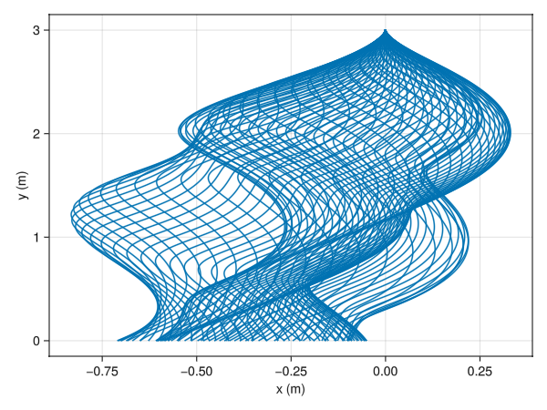
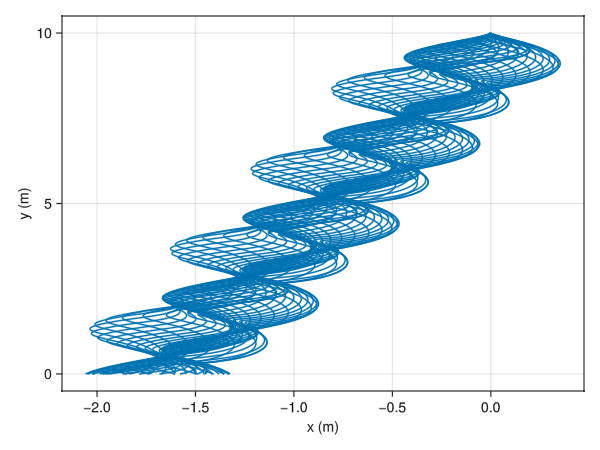

+++
title = '5cmpersecond'
date = 2025-08-20
math = true
tags = ["physics"]
+++

# *5 Centimeters per Second*

> …they say it’s five centimeters per second. The speed of a falling cherry petal. Five centimeters per second.

Accordning to the hit 2007 animated short film, [*5 Centimeters per Second*](https://en.wikipedia.org/wiki/5_Centimeters_per_Second) [^fancy] is the speed at which cherry petal fall.
Of course I'm skeptical and as a physicst I want to model the heck out of this.
So, in this article I would like to propose a model for a *thin*, *circular* flower petal to be the [spherical cow](https://en.wikipedia.org/wiki/Spherical_cow) of flower petals.

[^fancy]: A fancy way of saying an anime movie.

# The Model

Let's define our system.
We have have a circular, flat flower petal with radius $R$ that does not bend.
The flower petal has a mass surface density of $\sigma$ and a corresponding mass of $M = \sigma \pi R^2$ and area of $A = \pi R^2$.
The flower peta's center of mass (CM) is labeled with two Cartesian coordinates ($x$ and $y$) (the horizontal and upward directions).
Due to the circular symetry we will not consider a 3rd dimesion of movement.
The angle made between the disk petal and the horizontal is $\theta$.
In total this gives us three degrees of freedom.
We can measure the radial direction along the disk petal with the radius coordinate $h$
We will be dealing with dispersive forces in a non-relativistic setting, so the Newtonian theory will be suitable here.

## Forces

Using Newton's 2nd law of motion we have

$$
M \ddot r_{CM} = \sum_i F_i
$$

for the CM of equation of motion.
Since our object is extended we have 

$$
I \ddot \theta = \sum_i \tau_i
$$

for rotations *along* the $\theta$ angular direction about the CM.
For our setup we have two main sources of force: gravity and the air resistance.
Starting with the easiest, the gravity force.
The force of gravity can be written as

$$
F_g = - M g \hat y
$$

Nicely for use, the force of gravity generates no torque about the CM so $\tau_g = 0$.
Now for the hard part is the air force.

## Air Force

We can sketch the air force as $F_{air} = -k v$.
We can interprete it as a resistive force that acts against moving objects.
The $k$ is the proportionality paramter that depends on the properties of our petal -- like it's mass, composition, state, and geometry -- while $v$ is relative velocity of the object to the air. 

### Constant $k$ Air Force

To get a feel of this force let's consider the most simple case where $k$ is a constant scalar.
To make our first foray as simple as possible we will assume that the flower petal as no rotation.
Furthermore we only assume downward motion so we will only have to consider the equation of motion along the $y$ direction.

$$
M \ddot y = -Mg - k \dot y \implies   \ddot y = -g - \frac kM \dot y
$$

Solving for $\Delta y = y - y_0$, we have

$$
 \Delta y = -g \frac Mk t - \dot y_0 - g \frac Mk + (\dot y_0 + g \frac Mk) e^{-\frac kM t}
$$

For our case we will assume our flower petal starts at rest ($\dot y_0 = 0$), assuming it falls from some branch.

Let's notice a few things about this solution.
For large $t$, the exponential can be neglected.
So $\Delta y$ follows linear motion for large $t$.

$$
 \Delta y \approx -g \frac Mk t - g \frac Mk
$$

Here the petal is moving at terminal velocity where said terminal velocity is $g\frac Mk$ in the downwards direction.
The aformentioned movies states that flower petals move at $5cm/s$.
Setting the terminal velocity to $5cm/s$ and $g$ to $9.81 m/s^2$, we have

$\frac Mk = (5cm/s) / (981 cm/s^2) \approx 0.00510 s$

Assuming cherry blossoms weight about a tenth a gram.
We can approximate $k \approx 19.6 g/s = 0.0196 kg/s$.
Newton tells use thaat general 2nd law is that the change of the momentum is equal to the sum acting forces.
With this we can interpret this rate of mass change as coming from this principle where some pass is being shifted to cause this force.
For our cause this shifted mass is clearly the surrounding air.
Taking our petal to displace the amount of air it sweeps with it's area, we can approximate this rate as $\rho_{air} A v$.
$\rho_{air} = 1.1839 kg/m^3$, taken from [Wikipedia for density of air at 25 Celsius](https://en.wikipedia.org/wiki/Density_of_air).
Setting this displaced air to $k$ so $k = \rho_{air} A v$.
Solving for $A = k/(\rho_{air} v) \approx 0.331 m^2$.
For a circular disk, this implies that $R \approx 0.325 m = 32.5 cm$.
This is a bit large for a flower petal!
I think this model is telling us that the flower petal must be relatively large to fall slowly at a rate of $5cm/s$.
So, somehow we need to change our model so it allows for smaller surfaces to fall slower.
In other words, we need to catch more air.
One idea to do this is to note that flower petals do not just fall straight down, but flutter about can have quite complicated motions.
So to this end let's extend our model to introduce fluttering.

### Accouting of Petal Disk's Geometry Air Force

Let's now use the geometry of the flower petal to develop a more sophisticated air force term.
Let's derive a few key quatities before hand.
With the CM coordinates as $(x, y)$, the position of a point on the flower petal some distance from it's axis of rotation is $( x + h \cos(\theta) )\hat x + ( y + h \sin(\theta) )\hat y$.
We can derivate a velocity of such points.

$$
\dot x \hat x + \dot y \hat y + h \dot\theta (- \sin(\theta) \hat x + \cos(\theta) \hat y ) = \dot r + h \dot\theta (- \sin(\theta) \hat x + \cos(\theta) \hat y )
$$

The latter two terms form a vector that is normal to the surface of the petal.
We will express the unit normal vector (area vector) as $\hat A = - \sin(\theta) \hat x +  \cos(\theta) \hat y$.
So we can express the velocity vector as.

$$
v = \dot r + h \dot\theta \hat A
$$

Now we can our air force term.
The ieda is that we want to account for the geometry of the petal.
The petal sweeps some volume, displacing the occupying gass's mass.
To account for this we want to only resists motion that sweeps a volume.
This makes sense because, for large, light, flat objects, dropping edge wise, there is almost not affect on object.
On the other hand, droping face wise will result in a much more slower descent due to air resistance.
So for a small flat, rectgangular object we suppose the following air force.

$$
dF_{air} = -k ( v\cdot d\vec A ) d\hat A
$$

Integration will allow us to recover the full force.
Quick aside, for $|d\vec A|$ at a given $h$, we have $|d\vec A| =2 \sqrt{R^2 - h^2} dh$ as thin strip of the petal, parallel to the axis of rotation.
Now Let's apply the differential new air force to our case.

$$
dF_{air} = -k (\dot r + h \dot\theta \hat A) \cdot (|d\vec A| \hat A) = -2k (\dot r\cdot \hat A + h \dot\theta )\sqrt{R^2 - h^2} dh
$$

Now we can integrate to get $F_{air}$.

$$
\int dF_{air} = -2k\hat A \int_{-R}^{R} (\dot r\cdot \hat A + h \dot\theta )\sqrt{R^2 - h^2} dh = -k A (\dot r\cdot \hat A) \hat A
$$

To calculate the force we do a similar calculation.

$$
\tau_{air} = \int r_\tau \times dF_{air} = -2k \int_{-R}^{R} r_\tau \times \hat A (\dot r\cdot \hat A + h \dot\theta )\sqrt{R^2 - h^2} dh
$$

where $r_h = h(\cos(\theta) \hat x+ \sin(\theta) \hat y)$.
This simplifies to

$$
\tau_{air} = \int r_\tau \times dF_{air} = -\frac 14 k AR^2 \dot\theta\hat z
$$

where we can [evaluate the integral](https://www.wolframalpha.com/input?i=integrate+2+h%5E2+sqrt%28R%5E2-h%5E2%29+dh).
The $\hat z$ is the 3rd dimension, but it just represents the axis of rotation for the petal.
Now we, can just calculate the moment of inertia to compete the angular equation of motion[^leave].

[^leave]: I leave for the reader to do the integral.

$$
I = \int |r_\tau|^2 dm = 2 \sigma \int_{-R}^R |h|^2 \sqrt{R^2 - h^2} dh = \frac 14 MR^2
$$

Putting it all together we have three equation of motion.

$$
\ddot\theta = -(k/\sigma) \dot\theta
$$

$$
\ddot x = (k/\sigma) (\dot r\cdot \hat A) \sin(\theta)
$$

$$
\ddot y = - g - (k/\sigma) (\dot r\cdot \hat A) \cos(\theta)
$$

where recall that $\hat A = - \sin(\theta) \hat x +  \cos(\theta) \hat y$ so
$\dot r\cdot \hat A = -\dot x \sin(\theta)  +  \dot y\cos(\theta)$.
This model has more complicated motion so it's difficult to analyze.
On can notice that the $\theta$ equation of motion, it does not depend on the other varibles and is readily solvable. 

$$
\dot\theta = \dot \theta_0 e^{-k/\sigma t} \implies \Delta \theta = \frac { k\dot\theta_0 }\sigma  e^{-k/\sigma t}
$$

So if we start from rest, we can see that the petal does not rotate, but it is possible it could flutter.
Nonetheless, after some time the angle will stop changing, so with that reasoning let's assume the angle is constant for analysis on $x$ and $y$.
Even with this assumption, the equations of $\dot x$ and $\dot y$ are obscure.
But it general it has this form.

$$\ddot r = -\mathbf b - \mathbf A \dot r$$

where

$$
\mathbf b =
\begin{bmatrix}
0 \\\\ g
\end{bmatrix},
$$

$$
\mathbf A = \frac{k}{\sigma}
\begin{bmatrix}
\sin^2\theta & -\sin\theta \cos\theta \\\\
-\sin\theta \cos\theta & \cos^2\theta
\end{bmatrix}.
$$

We can solve for $r$ here.

$$
\Delta r =  \left( \frac{1}{\kappa} \mathbf A \mathbf b - \mathbf b \right) \frac{ t^2 }2 + \left( -\frac{1}{\kappa^2}\mathbf A \mathbf b -\frac{1}{\kappa}\mathbf A \mathbf c_1  + \mathbf c_1 \right) t - \frac{1}{\kappa^2}e^{-\kappa t}\mathbf A \mathbf c_1
$$

where $\kappa = k/\sigma$.
There are a few differences from the constant case.
There is a terminal acceleration!
This acceleration only depends on the $g$ and the orientation, $\theta$.

$$
a_t = -g \sin (\theta) (\cos (\theta) \hat x + \sin(\theta)\hat y)
$$

This acceleration is similar if not the same as acceleration of a block accelerating down an incline plain of $\theta$ angles.
For a flat petal, there is now terminal acceleration.
Likewise, if the petal is aligned vertically there is maximal terminal acceleration.

Now, looking at the ternimal velocity were $\dot r_0 = 0$.
So we have

$$
\mathbf c_1 = \frac{1}{\kappa^2}\mathbf A \mathbf b
$$

$$
v_t = -\frac{1}{\kappa^2}\mathbf A \mathbf b = g \cos (\theta) \left( \sin (\theta)  \hat x - \cos(\theta) \hat y \right) = - \frac {g \sigma}{k} \cos (\theta) \hat A
$$

Now we can see that the terminal velocity is aligned with the area vector.
Also there is a dependence on the angle.
For a flat petal, there is maximal terminal velocity downwards.
Again on the other hand, for an upright petal, there is seemingly like not terminal velocity.
We could have a single flutter as the petal goes right or left as it falls, but now has a generic terminal acceleration.
Thus we need another modification or our model.

### Deforming the Petal

For our modification, we do not want just a flat disk geometry for our petal.
To do that we can bend the surface of the petal geometry.
This is to allow fro air to hit the surface not uniformly.
Let's recall the differential air force from the previous system.

$$
dF_{air} = -k ( v\cdot d\vec A' ) d\hat A'
$$

The $d\hat A$ can be modified to depend on $h$.
To implement this let's add a modifaction to the $\theta \to \theta \frac hR \alpha$.
Here $\alpha$ is some dimensionless parameters that parameterizes the amount of bending.
As a result our $d\vec A$ changes.

$$
d\vec A' = |d\vec A| (- \sin(\theta + \frac hR \alpha) \hat x +  \cos(\theta + \frac hR \alpha) \hat y)
$$

Practically and realistically, this bending can/should be small.
So we can expand $d\vec A$ around $\theta$ for small $\alpha$.

$$
d\vec A' \approx |d\vec A| (- \sin(\theta) \hat x +  \cos(\theta) \hat y - \alpha\frac hR ( \cos(\theta) \hat x + \sin(\theta) \hat y)) + \mathcal O(\alpha^2)
$$

Furthermore, we have

$$
|d\vec A'| \approx |d\vec A| + \mathcal O(\alpha^2)
$$

$$
d\hat A' \approx (- \sin(\theta) \hat x +  \cos(\theta) \hat y - \alpha\frac hR ( \cos(\theta) \hat x + \sin(\theta) \hat y)) + \mathcal O(\alpha^2)
$$

We can simply write our differential area vector.

$$
d\vec A' \approx |d\vec A| (\hat A - \alpha\frac hR \hat r_h) + \mathcal O(\alpha^2)
$$

Note that $\hat A$ and $\hat r_h$ are perpendicular, $\hat A \cdot \hat r_h = 0$.
So our total force can now be evaluated.

<!-- $$ -->
<!-- \int dF_{air} = \int_{-R}^{R} -k ( ( \dot r + h \dot\theta \hat A ) \cdot (\hat A - \alpha\frac hR \hat r_h) ) (\hat A - \alpha\frac hR \hat r_h) (2\sqrt{R^2 - h^2} dh) -->
<!-- $$ -->

<!-- $$ -->
<!-- \int dF_{air} = \int_{-R}^{R} -k (\dot r \cdot\hat A - \alpha\frac hR \dot r\cdot\hat r_h + h \dot\theta ) (\hat A - \alpha\frac hR \hat r_h) (2\sqrt{R^2 - h^2} dh) -->
<!-- $$ -->

<!-- $$ -->
<!-- \int dF_{air} = \int_{-R}^{R} -k (\dot r \cdot\hat A \hat A + \alpha^2\frac { h^2 }{ R^2 } \dot r\cdot\hat r_h \hat r_h - \alpha \dot\theta\frac {h^2}R \hat r_h )  (2\sqrt{R^2 - h^2} dh) -->
<!-- $$ -->

<!-- $$ -->
<!-- \int dF_{air} = \int_{-R}^{R} -k (\dot r \cdot\hat A \hat A - \alpha \dot\theta\frac {h^2}R \hat r_h )  (2\sqrt{R^2 - h^2} dh) -->
<!-- $$ -->

$$
\int dF_{air} = A k (-(\dot r\cdot\hat A) \hat A  + \alpha \dot\theta \frac{R}{4} \hat r_h )
$$

<!-- $$ -->
<!-- \tau_{air} = \int r_h\times dF_{air} = \hat z \int_{-R}^{R} -k h ( ( \dot r + h \dot\theta \hat A ) \cdot (\hat A - \alpha\frac hR \hat r_h) )  (2\sqrt{R^2 - h^2} dh) -->
<!-- $$ -->

<!-- $$ -->
<!-- \tau_{air} = \int r_h\times dF_{air} = \hat z k (\frac \alpha R \dot r \cdot\hat r_h - \dot\theta) \int_{-R}^{R} h^2   (2\sqrt{R^2 - h^2} dh) -->
<!-- $$ -->

$$
\tau_{air} = \int r_h\times dF_{air} = k (\frac \alpha R \dot r \cdot\hat r_h - \dot\theta) \frac{A R^2}{4} \hat z
$$

<!-- 

Integrate[2 Sqrt[R^2-h^2] h^2, {h, -R, R}]//TeXForm
Integrate[2 Sqrt[R^2-h^2], {h, -R, R}]//TeXForm

-->

Where we kept only up to first order in $\alpha$, we leave the integration to the reader.
Now, we can write equation of motion.

$$
\ddot\theta = (k/\sigma) \left(\frac \alpha R \dot r \cdot\hat r_h - \dot\theta\right)
$$

$$
\ddot x = (k/\sigma) \left((\dot r\cdot\hat A) \sin\theta  + \frac 14 \alpha R\dot\theta  \cos\theta \right)
$$

$$
\ddot y = - g + (k/\sigma) \left(-(\dot r\cdot\hat A) \cos \theta + \frac 14 \alpha R\dot\theta \sin\theta \right)
$$

Now, we have a more sophisticated model!
Nevertheless, this model has a semi-obvious problem.
It's hard[^impossible] to solve analytically.
I lieu of that we can solve this differential equation numerically for several initial conditions for static initial static center of mass.
These nummerical calculations can be found in accompanying the [Pluto notebook](5cmpersecond.jl).
Note that we also included the simplified air force of the form $-k' \dot r$.[^differenk]
Samlping over a range of initial orientations we have the following petal falling paths.

Using "realistic" paramters, we were able to find the petals that fall at $\sim72 cm/s$ -- a far cry from but in the same ballpark as $5cm/s$.
One can check the notebook for used paramters.
The parameters used to get the $72cm/s$ are 
$k/\sigma = 20.0 s^{-1}$, $g = 9.81 m/s^2$, $R = 1 cm$, $\alpha = 0.03$, $y_0 = 10.0$, and $k'/M = 4.0 s^{-1}$.
I leave it to the reader to play with other constants in the notebook.

[^impossible]: Maybe impossible!
[^differenk]: Notice the different proportionality constant, $k'$.

# Conclusion

It's possible with a more refined model and a clever choice of paramters can reproduce the 5 centimeters per second from the animated movie.
Nevertheless, it's surprising to see how far one can get with the simple model presented in this blog post.
Possible a next step would be to go full numerical make the petal full simulated as a 3D model with flexing and bending, interacting with air modeled as a fluid.
One the other hand having a model which simple as possible and reproduces the the behavior of the sakura petals would be great to get.
Possibly use a simple model can be derived and is more simple than the final model of this paper.

# Further Reading:

- [*5 Centimeters per Second*](https://en.wikipedia.org/wiki/5_Centimeters_per_Second)
- [A site to determine an quick apprixmation of a flower petal's mass](https://allroses.wiki/how-much-does-a-rose-petal-weigh/)
- [Pluto notebook](5cmpersecond.jl) used for the numerics

# Appendix

## Solving for Constant Air Force

We start with 

$$
\ddot y = -g - \frac kM \dot y
$$

We can rearrage the equation.

$$
\frac d{dt} \dot y + \frac kM \dot y = -g
$$

We can solve for $\dot y$ using a first order ODE solving technique.

$$
e^{\frac kM t} \frac d{dt} \dot y + \frac kM e^{\frac kM t}\dot y = -ge^{\frac kM t}
$$

$$
\frac d{dt} ( e^{\frac kM t} \dot y ) = -ge^{\frac kM t}
$$

$$
e^{\frac kM t} \dot y = -g \frac Mk e^{\frac kM t} + C_1
$$

$$
 \dot y = -g \frac Mk  + C_1 e^{-\frac kM t}
$$

$$
 y = -g \frac Mk t + C_2  + C_1 e^{-\frac kM t}
$$

Plugging in $t=0$, we can solve for $C_1$ and $C_2$.

$$
 y_0 = C_2 + C_1
$$

$$
 \dot y_0 = -g \frac Mk + C_1
$$

so

$$
  C_1 = \dot y_0 + g \frac Mk
$$

$$
 C_2 = y_0 - \dot y_0 - g \frac Mk
$$

$$
 y = -g \frac Mk t + y_0 - \dot y_0 - g \frac Mk + (\dot y_0 + g \frac Mk) e^{-\frac kM t}
$$

So the final solution is 

Writing as the total displacement for the start, we have.

$$
 \Delta y = -g \frac Mk t - \dot y_0 - g \frac Mk + (\dot y_0 + g \frac Mk) e^{-\frac kM t}
$$

## Solving for Accouting of Petal Disk's Geometry Air Force

We can rearrage our equation 

$$\ddot r + \mathbf A \dot r = -\mathbf b$$

where

$$
\mathbf b =
\begin{bmatrix}
0 \\\\ g
\end{bmatrix},
$$

$$
\mathbf A = \kappa
\begin{bmatrix}
-\sin^2\theta & \sin\theta \cos\theta \\\\
\sin\theta \cos\theta & -\cos^2\theta
\end{bmatrix}.
$$

$$e^{\mathbf At}\ddot r + \mathbf A e^{\mathbf At} \dot r = -e^{\mathbf At}\mathbf b$$

Using the fact that $\mathbf A e^{\mathbf At} = e^{\mathbf At} \mathbf A$.
We also defined a confined a convenience variable $\kappa := k/\sigma$

$$\frac{d}{dt}(e^{\mathbf At}\dot r) = -e^{\mathbf At}\mathbf b$$

At this point we can integrate, but since $\det \mathbf A = 0$, we need the explicit expression for $e^{\mathbf At}$.
Notice that the property of $\mathbf A^2 = \kappa \mathbf A$[^projection].
This property will allow us to evaluate matrix exponential.

[^projection]: This is because in fact $\kappa A$ is a project matrix. This fact was told to me by GPT.

$$
e^{\mathbf At} = \sum_{n=0} \frac{1}{n!} (\mathbf A t)^n = 1 + \sum_{n=1} \frac{1}{n!} \kappa^{n-1} \mathbf A t^n = 1 + \mathbf A \frac 1\kappa \sum_{n=1} \frac{1}{n!} \left(\kappa t\right)^n
$$

$$
e^{\mathbf At} = 1 + \frac 1\kappa ( e^{\kappa t} - 1) \mathbf A
$$

Using this formula, we can plug in for $e^{\mathbf At}\mathbf b$.

$$
\frac{d}{dt}(e^{\mathbf At}\dot r) = -\mathbf b - \frac 1 \kappa ( e^{\kappa t} - 1) \mathbf A\mathbf b
$$

Now we can integrate.

$$
e^{\mathbf At}\dot r = -\mathbf b t - \frac 1\kappa ( \frac {e^{\kappa t}}\kappa  - t) \mathbf A\mathbf b + \mathbf c_1
$$

After multiplying by the exponential's inverse, we can have the velocity.

$$
e^{-\mathbf At} = e^{\mathbf A(-t)} = 1 + \frac 1\kappa ( e^{-\kappa t} - 1) \mathbf A
$$

$$
\dot r = e^{-\mathbf At} \left( -\mathbf b t - \frac 1\kappa \left( \frac {e^{\kappa t}}\kappa  - t\right) \mathbf A\mathbf b + \mathbf c_1 \right)
$$

$$
\dot r = (1 + \frac 1\kappa ( e^{-\kappa t} - 1) \mathbf A) \left( -\mathbf b t - \frac 1\kappa \left( \frac {e^{\kappa t}}\kappa  - t\right) \mathbf A\mathbf b + \mathbf c_1 \right)
$$

$$
\dot r = -\mathbf b t - \frac 1\kappa \left( \frac {e^{\kappa t}}\kappa  - t\right) \mathbf A\mathbf b + \mathbf c_1 + \frac 1\kappa ( e^{-\kappa t} - 1) \left( -\mathbf A \mathbf b t - \left( \frac {e^{\kappa t}}\kappa  - t\right) \mathbf A\mathbf b + \mathbf A \mathbf c_1\right) 
$$

$$
\dot r = \frac{1}{\kappa^2} (\kappa t-1) \mathbf A \mathbf b +\frac{1}{\kappa} \left(e^{-\kappa t}-1\right) \mathbf A \mathbf c_1 - \mathbf b t + \mathbf c_1
$$

We can orginized by factors of $t$.

$$
\dot r =  \left( \frac{1}{\kappa} \mathbf A \mathbf b - \mathbf b \right) t -\frac{1}{\kappa^2}\mathbf A \mathbf b -\frac{1}{\kappa}\mathbf A \mathbf c_1  + \mathbf c_1 + \frac{1}{\kappa}e^{-\kappa t}\mathbf A \mathbf c_1
$$

Solving for $\mathbf c_1$ we find.

$$
\mathbf c_1 = \dot r_0 + \frac{1}{\kappa^2}\mathbf A \mathbf b
$$

We can finally integrate one more time.

$$
\Delta r =  \left( \frac{1}{\kappa} \mathbf A \mathbf b - \mathbf b \right) \frac{ t^2 }2 + \left( -\frac{1}{\kappa^2}\mathbf A \mathbf b -\frac{1}{\kappa}\mathbf A \mathbf c_1  + \mathbf c_1 \right) t - \frac{1}{\kappa^2}e^{-\kappa t}\mathbf A \mathbf c_1
$$

<!-- $$ -->
<!-- \Delta r = \frac{1}{\kappa^2} \left(\frac \kappa2 t^2-t\right) \mathbf A \mathbf b +\frac{1}{\kappa} \left(-\frac 1\kappa e^{-\kappa t}-t\right) \mathbf A \mathbf c_1 - \frac 12\mathbf b t^2 + \mathbf c_1 t -->
<!-- $$ -->

<!-- We can orginized by factors of $t$. -->

<!-- $$ -->
<!-- \Delta r = \frac {t^2}2 \left(\frac {\mathbf A}{\kappa}  \mathbf b - \mathbf b\right) +  t\left( - \frac{1}{\kappa^2}  \mathbf A \mathbf b -\frac{1}{\kappa}\mathbf A \mathbf c_1  + \mathbf c_1  \right) -\frac{1}{\kappa^2} e^{-\kappa t}\mathbf A \mathbf c_1 -->
<!-- $$ -->
