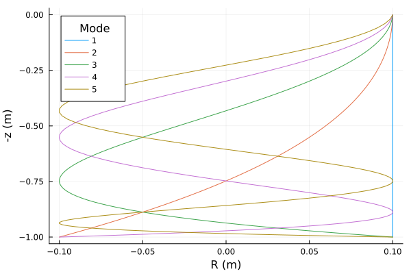
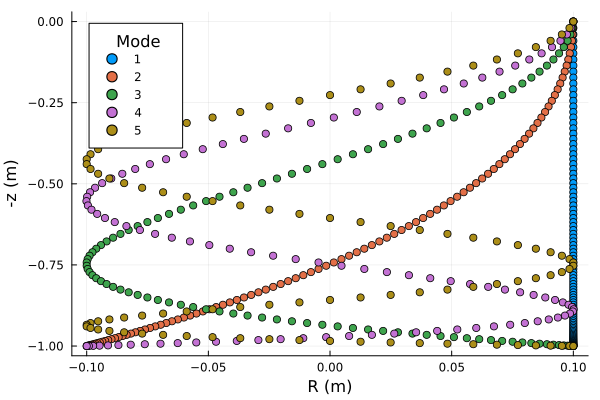
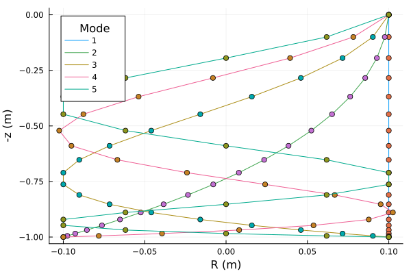

+++
title = 'Hanging Wave Chain'
date = 2025-09-11T12:51:08+09:00
math = true
draft = true
+++

Perusing [Reddit](https://www.reddit.com/) I found someone [asking about a hanging chain](https://www.reddit.com/r/PhysicsHelp/comments/1n8ymrz/what_is_this_effect_called/).
The [post](https://www.reddit.com/r/PhysicsHelp/comments/1n8ymrz/what_is_this_effect_called/) in question has a semi-quality video of someone whirling a chain from one end in a circle.
The rest of the freely swinging chain forms a particular shape as it rotates around some center axis.
In short, this appends because of the centrifugal force from the rotation axes against the binding force of the chain links.
I want to take some time to really understand this with physics of course.

# The Setup

Let's model the chain links as $N$ linked springs.
The top link is labeled $i = 1$ and the last one is labeled $i = N$.
Each spring has a spring constant of $k$ and mass of $m$.
The acceleration of gravity is $g$.
Our coordinate system is the cylindrical coordinate system.
Downward is the positive $z$ direction, and the horizonal directions are parameterized with $R$ and $\theta$.
Now let's write the Lagrangian!

\begin{equation}
    L = \int dt  m \sum_{i=1}^{N} \left(\frac 12 \left( \dot z_i^2 + R^2 \dot \theta_i^2 + \dot R_i^2 \right) + g z_i\right) - \frac k2 \sum_{i=1}^{N-1} \left(\vec x_{i+1} - \vec x_{i}\right)^2
\end{equation}

Here $\vec x_i$ is just the position vector of the $i$'th spring.

# The equations of motion...

We can vary the $3N$ varibles leading to $3N$ equations.
But, in reality, we are only concerned with a special configuration.
For our case, we assume $\dot z_i = \dot R_i = 0$ and $\dot \theta_i = \mathrm{constant} = \omega$.

## Vertical Configuration
For the $z_i$ coordinates:

\begin{equation}
0 = k \Big[ (z_{i+1} - z_i) - (z_i - z_{i-1}) \Big] + m g
\end{equation}

With the $z_1 = 0$ fixed and the last link to be to swing freely.
The last link thus obey the following equation.

\begin{equation}
0 = - k (z_i - z_{i-1}) + m g
\end{equation}

The solution for $N$ links is

\begin{equation}
z_n = \frac{m g (n-1) (2 N-n)}{2 k}
\end{equation}

The lowest distance the chain will droop is.

\begin{equation}
z_N = \frac{m g N (N-1) }{2 k}
\end{equation}

Going for a meter droop, we have $1m = \frac{m g N (N-1)}{2 k}$, so let's set this combo of variables to 1.

So our final $z_n$ is

\begin{equation}
z_n = \frac{(n-1) (2 N-n)}{N (N-1)} 
\end{equation}

Measured in meters.

---

## Radial balance

For the $R_i$ coordinates (centripetal balance):

\begin{equation}
    -\frac{ m R_i \omega^2 }k = \Big[ (R_{i+1} - R_i) - (R_i - R_{i-1}) \Big]
\end{equation}

To set the first $R_0$ to a certain value, the $R$'s in whole must obey an eigenvalue problem.
I will leave it to the reader to formulate this as finding the eigenvalues of a matrix.
Here the eigenvalue is $m \omega^2/k$.
From before we can replace the $m/k = 2/(g N (N-1)) \approx 0.204/(N (N-1)) \text{s/m}$.
Finding the frequency we can solve for $\omega$ in $\lambda = m \omega^2/k$.
This implies that 

\begin{equation}
f = \frac 1{2\pi} \frac km \approx 0.780 N (N-1) \lambda \mathrm{Hz}
\end{equation}

Here $\lambda$ is a eigenvalue.
Looking at the first smallest eigenvalues we find.

Here’s the updated table with the new column titled **$f$ Hz (N=20)** added:

| Mode | $\lambda_i$ | $f$ Hz (N=100) | $f$ Hz (N=20)                |
|------|-------------|----------------|-----------------------------|
| 1    | 0.0         | 0.0            | 0.0                         |
| 2    | 0.000987    | 7.63           | 7.30                        |
| 3    | 0.00395     | 30.5           | 29.04                       |
| 4    | 0.00888     | 68.6           | 64.67                       |
| 5    | 0.0158      | 121.           | 113.31                      |

The new column has been populated with the provided data.The first mode is just not move the chain at all.
The second one is the lowest mode is the first non-trivial mode.
This needs 7Hz of waving in circles.
This is possible but possibly exhausting.
The second largest is around 31 Hz which would be a challege for sure.
The first 5 mode chain profiles look like the following where $N=100$

As you can see in the graph, gravity is predicted to make the modes scrunch up at the bottom.
Here is a the same graph with positions of the chain links shown.

Of course, for a "realistic" chain we can use fewer links.

# References

- [Pluto Notebook](./notebook.jl)
