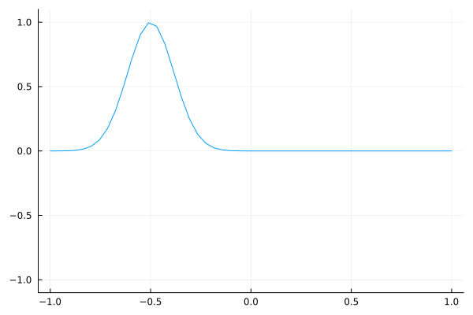
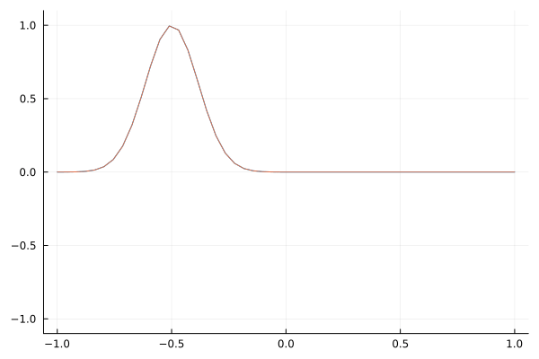
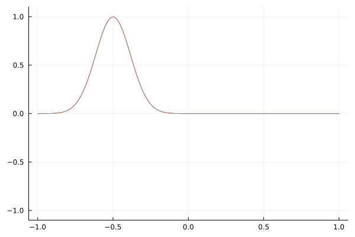
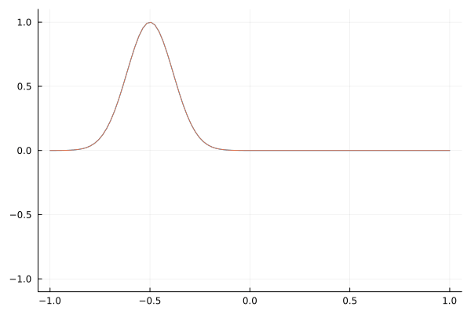

+++
title = 'Speed of Light Dielectric'
date = 2024-01-28T15:20:55+09:00
math = true
tags = ["math", "julia", "physics"]
slug = 'speed-of-light-dielectric'
+++

I was watching a [youtube video](https://www.youtube.com/watch?v=WQfqHDsHAZM) [^watch].
The video was about the speed of light in a medium and 
I think it would intresting to do some relaxing programming with Julia. 
Specifically, I would like simulate some light propogating media with varying dielectric.
This post will go with the following steps.

[^watch]: I watch a lot of youtube XP.

1. Derive the equations from Maxwell's equation in a dielectric.
1. Simulate the wave equations.
1. Explore!

# From Maxwell's Equations

Here are Maxwell's Equations known in a dielectric in general[^mag].

[^mag]: More or less, because we already made the assumption that $\mu_0 \mathbf H = \mathbf B$.

\begin{equation}
    \nabla \cdot (\varepsilon_0 \mathbf{E} + \mathbf{P}) = \rho_{\text{free}}
\end{equation}

\begin{equation}
    \nabla \cdot \mathbf{B} = 0
\end{equation}

\begin{equation}
    \nabla \times \mathbf{E} = - \frac{\partial \mathbf{B}}{\partial t} \tag{Faraday}
\end{equation}

\begin{equation}
    \nabla \times \mathbf{B} = \mu_0 \mathbf{J}_{\text{free}} + \mu_0 \frac{\partial}{\partial t}(\varepsilon_0 \mathbf{E} + \mathbf{P})
\end{equation}

We are just concerned with free traveling waves.
So the free current and charge densities can be set to vanish.

\begin{equation}
    \nabla \cdot (\varepsilon_0 \mathbf{E} + \mathbf{P}) = 0
\end{equation}

\begin{equation}
    \nabla \times \mathbf{B} = \mu_0 \frac{\partial}{\partial t}(\varepsilon_0 \mathbf{E} + \mathbf{P})
\end{equation}

Further more, let's conside a linear dielectric.
So the polorization is $\mathbf{P} = - \varepsilon_0 \chi (x) \mathbf E$ and the equations transform to the following.

\begin{equation}
    \nabla \cdot \varepsilon_0 (\mathbf{E} - \chi (x) \mathbf E) = 0 \tag{Gauss 1}
\end{equation}

\begin{equation}
    \nabla \times \mathbf{B} = \mu_0 \varepsilon_0 (1 - \chi (x)) \frac{\partial}{\partial t}\mathbf{E} \tag{Ampere}
\end{equation}

The keen eyed might have noticed that $\chi$ is left to be variable along the $x$ direction.
This leads to a possibility of (Gauss 1) having a bound carge, induce by the variation of $\chi$.
To keep our life easy, we can consider light with polorizations that point orthogonal to $x$ which can be in any direction in the $y-z$ plane.
For definiteness, let's choose polarization in the $y$ direction.
This allows for the further simplification.

\begin{equation}
    \nabla \cdot \mathbf E = 0 \tag{Gauss 2}
\end{equation}

Now we can take the time derivative of (Ampere) and sub in (Faraday).


\begin{equation}
    \nabla \times \frac{\partial}{\partial t} \mathbf{B} = \varepsilon_0 \mu_0 (1 - \chi (x)) \frac{\partial^2}{\partial t^2}\mathbf{E}
\end{equation}

\begin{equation}
    - \nabla \times \nabla \times \mathbf{E} = \mu_0 \varepsilon_0 (1 - \chi (x)) \frac{\partial^2}{\partial t^2}\mathbf{E}
\end{equation}

[Curl of curl](https://en.wikipedia.org/wiki/Vector_calculus_identities#Curl_of_curl) can be rewritten and then we can apply (Gauss 2).

\begin{equation}
    - (\nabla (\nabla {\cdot }\mathbf E )-\nabla^2\mathbf E) = \mu_0 \varepsilon_0 (1 - \chi (x)) \frac{\partial^2}{\partial t^2}\mathbf{E}
\end{equation}

\begin{equation}
     \nabla^2\mathbf E = \mu_0 \varepsilon_0 (1 - \chi (x)) \frac{\partial^2}{\partial t^2}\mathbf{E}
\end{equation}

Let's use natural units (i.e. $c=1$) so this equation becomes

\begin{equation}
     \frac 1{ 1 - \chi (x) } \nabla^2\mathbf E =  \frac{\partial^2}{\partial t^2}\mathbf{E} .
\end{equation}

Effectively, $(1 - \chi (x))$ is the fraction of light speed of light squared in these units.
This means if our light propogates with some velocity $v$ in a dielectric, it's speed can be expressed as $( v/c )^2 = 1-\chi \implies v = c \sqrt{1-\chi}$ where we restrict $v \lt 1$.

\begin{equation}
     v^2\nabla^2\mathbf E =  \frac{\partial^2\mathbf{E}}{\partial t^2}.
\end{equation}

We are just intrested in $\mathbf E = \mathbf E^y \mathbf e_y$ with only $(t, x)$ dependence.

\begin{equation}
     v^2 \frac{\partial^2\mathbf{E}^y}{\partial x^2} =  \frac{\partial^2\mathbf{E}^y}{\partial t^2}
\end{equation}

With [abuse of notation](https://en.wikipedia.org/wiki/Abuse_of_notation), we can write

\begin{equation}
     v^2 \frac{\partial^2 E}{\partial x^2} =  \frac{\partial^2 E}{\partial t^2}.
\end{equation}

In general, solutions to [this equation](https://en.wikipedia.org/wiki/Wave_equation) take the form 

\begin{equation}
    E(t,x) = f_r(x-vt) + f_l(x+vt) \tag{Wave}
\end{equation}

## Boundary Condition

To simulate this in Julia[^finally], we have to truncate the domain since computers have yet to have infinite memory.
We can simply have outgoing boundary conditions at the left and right spatial domain.
Notice in (Wave), there are two functions. 
With some thought, one can realize that $f_r$ ($f_l$) represent waves that move right (left)[^thus].
So, we can restrict our wave equation to move left on the left boundary of the spatial domain and right on the right side.

[^finally]: Finally!
[^thus]: Thus the names!

\begin{equation}
    \begin{aligned}
        E(t,x_l) &= f_l(x_l+vt)\\\\
        E(t,x_r) &= f_r(x_r-vt)
    \end{aligned}
\end{equation}

This implies in terms of derivatives that

\begin{equation}
    \begin{aligned}
        E^{(1,0)}(t,x_l) = v E^{(0,1)}(t,x_l)\\\\
        E^{(1,0)}(t,x_r) = -v E^{(0,1)}(t,x_r)
    \end{aligned}
\end{equation}

# Simulate the wave equations.

We are ready to simulate the wave equation (Julia)
Concretely, we need to use the three following equations.

\begin{equation}
    \begin{aligned}
        v^2 \frac{\partial^2 E}{\partial x^2} & =  \frac{\partial^2 E}{\partial t^2}\\\\
        v E^{(0,1)}(t,x_l) &= E^{(1,0)}(t,x_l)\\\\
        -v E^{(0,1)}(t,x_r) &= E^{(1,0)}(t,x_r)
    \end{aligned}
\end{equation}

In order to simulate such equation, we need to discretize the spatial, $x$, and temporal, $t$, variables.
To make it simple, let's use a equidistant/equitemporal discretization.

So for $x$, we will restrict $x$ to $x\in[-1, 1]$ where $x$ can only take values indexed by ${ i\in\{1...N\} }$ and $x_i = 2(i-1)/(N-1)-1$.

In julia you can write this with

```julia
function make_grid(n)
	return collect(range(-1, 1, length=n))
end
```

With this grid, we would like to discretize $\partial^2 E/\partial x^2$.
A way is with [finite differencing](https://en.wikipedia.org/wiki/Finite_difference), which is the definition of derivatives but [without the $\mathrm{lim}$](https://en.wikipedia.org/wiki/Derivative#Definition) .
For the second derivative, we use (Approx 2nd 1)

\begin{equation}
    \tag{Approx 2nd 1}
    E''(x) \approx \frac{E(x+h) - 2E(x) + E(x-h)}{h^2}
\end{equation}

where $h$ is the distant between two grid points.
We can also write the second derivative as (Approx 2nd 2).

\begin{equation}
    \tag{Approx 2nd 2}
    \begin{aligned}
        E^{\prime\prime}(x_i) &\approx (E(x_{i+1}) - 2E(x_{i}) + E(x_{i-1}))/h^2 \\\\
         &\approx (E_{i+1} - 2E_{i} + E_{i-1})/h^2 \\\\
    \end{aligned}
\end{equation}

For the first derivative for later.

\begin{equation}
    \tag{Approx 1st}
    E^{\prime}(x_i) \approx (E_{i+1} - E_{i})/h
\end{equation}

where $h = x_{ i + 1 } - x_i$. [^arb]

[^arb]: $i$ is arbitrary because the gridpoints are equidistant.
In Julia[^gptcomments] we can write this as

[^gptcomments]: Comments provided by ChatGPT.

```julia
function dd(E, h)
	ddE = similar(E)
	for i in 2:length(E)-1
		E1 = E[i-1]
		E2 = E[i+0]
		E3 = E[i+1]
		ddE[i] = (E1-2*E2+E3)/h^2
	end
	return ddE
end
```

There is a problem though, we do not have $E_{0}$ nor $E_{N+1}$ so this finite difference formula can not find the second derivative for the end points.

To solve this we will replace the wave equation at the $x$ bounds with the boundary equations.

```julia
struct ElectricField{T}
	pos::T
	vel::T
end

function time_step(e::ElectricField, dt, h, eps = 1)
    # Update position based on velocity and time step.
    newpos = e.pos + dt * e.vel 
    
    # Update velocity based on spatial derivative and eps.
    # The .* operator is used for element-wise multiplication.
    newvel = e.vel + dt * eps .* dd(e.pos, h)
    
    # Boundary condition at start: adjust first velocity based on eps and
    # spatial step size (h), considering first two positions.
    newvel[begin] = sqrt(eps[begin]) * (e.pos[begin+1] - e.pos[begin]) / h 
    
    # Boundary condition at end: adjust last velocity similarly, using
    # positions at the end.
    newvel[end] = -sqrt(eps[end]) * (e.pos[end] - e.pos[end-1]) / h 
    
    # Return updated ElectricField object with new position and velocity.
    return ElectricField(newpos, newvel)
end
```

# Explore Wave Propagation in Different Mediums

Finally, we can simulate propagation of $E$.
There are a few cases I personally would like to look at but feel free to mess around with the [Pluto Notebook](./dielectric_wave_prop.jl).
<!-- This collection of animations illustrates the fascinating behavior of light waves as they propagate through various mediums. --> 
<!-- The comparison between light in a vacuum and light interacting with dielectric materials reveals the profound impact of medium properties on wave propagation. -->

The animations use two colors to differentiate the conditions:
- **Blue** represents light traveling in a vacuum.
- **Orange** (if displayed) represents light as it travels through a medium with a dielectric applied in which the speed of the light wave is different.

**Remember that units are in natural units.**
y-axis is $E$ and x-axis is $x$.

## Simple Wave Propagation



As a sanity check, here is a a simple Gaussian wave packet that travels to the right.

## Dielectric Constant Boundary


Observe the effect of a sudden change in the dielectric constant at a boundary.
It is interesting to see that a simple change of wave speed causes reflection.

## "Tanh" $v^2$ Profile

What about for a medium which does not abruptly change the wavespeed but gradually.
We can use $$v^2(x) = \frac{v^2_f-v^2_i}{2} \tanh(3x) + \frac{v^2_f+v^2_i}{2}~.$$

### $v^2$ Profile 1.0 to 0.2

For the first profile, the speed slows down.
An intresting thing is that compared to the abrupt change, reflecting wave is more spread out.
In other words, the reflected wave seems to have much longer wavelength.



### $v^2$ Profile 1.0 to 0.0

An extrem example, is to send the wave speed to zero.
One can see that the impinging seems to eventually vanish on the left boundary.
A more physical mirror I get could be represented by this since a perfect mirror would not allow light to propogate into because all of it's reflected.
In other words the light cannot travel into (speed = 0).



This animation takes the modulation further, transitioning the dielectric properties from 1 to almost 0. 
It highlights extreme conditions and their dramatic effects on wave propagation.

### Tanh vsqr Profile From 1 to FTL (Faster Than Light)



This scenario imagines a transition from normal light speed to conditions supporting faster-than-light (FTL) travel. 
The obvious speed up is obvious, but there are two interesting things.
The reflection is minimum and the magnitude of the $E$ field increases.
According the the [Poynting vector](https://en.wikipedia.org/wiki/Poynting_vector), this increase in field magnitude corresponds to more energy flux.
So, this seems like the medium that light travels has energy stored in it!
For $v^2 \rightarrow \infty$, would the energy flux to to infinite?

---

I think I could go on for days tinkering with this, but I will let the reader have their fun.
Even though this system was simple[^simple], I think some interesting results surfaced.
Thanks for reading!

[^simple]: simple by design 😉

<!-- # Explore! -->

<!-- The blue is light in a vacuum and orange (if displayed) is with a dielectric is applied. -->

<!--  -->
<!--  -->

<!--  -->
<!--  -->

<!--  -->

# Read More

- [Videos Code Repo](https://github.com/mithuna-y/speed_of_light_in_a_medium/tree/main)
- [Pluto Notebook](./dielectric_wave_prop.jl "SLB Notebook")
