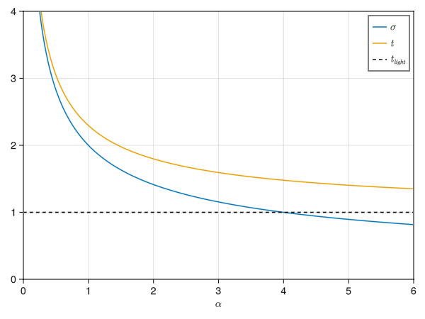
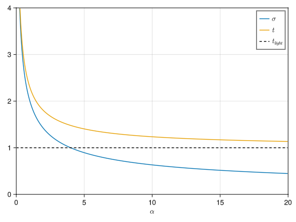

+++
title = 'Time to Proxima'
date = 2025-07-13T18:40:50+09:00
math = true
+++

# Traveling the Stars

The speed of light is the ultimate speed limit.
This got me thinking about how this fact plays with Einstein's theory of special relativity.
Like if I had a spaceship that was able to provide a constant thrust, how long would it take for me to get to some distant star, say Proxima Centauri.

# Traveling our Galaxy

Let's set the scene.
We have some distance to travel, $L$.
The spaceship plus us [^together] have a total mass $M$.
The speed of light is, of course, $c$.
The ship can produce a thrust without losing mass, $F$.
Now let's look at how the ship moves.

## Einstein's Second Law

According to Einstein, particles under a constant force will travel as

$$
\frac{dp}{ds} = F \tag{Second Law}
$$

$p$ is the relativistic momentum and $s$ is the time as recorded by the spaceship.
So, this equation states that the momentum per time of our spaceship increases by $F$.
An observer on Earth would measure our clock ticking at a different rate according to our speed.
A small elapsed span of Earth time is $dt$.
Relating it to $ds$, we have $ds = dt \sqrt{1 - \vec v^2/c^2}$.
So the second law becomes
$$
\gamma\frac{dp}{dt} = F \tag{Second Law}
$$
where $\gamma := 1/\sqrt{1 - v^2/c^2}$.

Taking our ship to travel along one direction [calculations here](#rate-momentum-change-calculations) we find the second law can be written as

$$
\frac{M a}{(1 - v^2/c^2 )^2} = F \tag{Second Law}
$$

where $a$ is the acceleration.
At this point, we can introduce some units.

$$
\frac{Ma}{(1 - v^2/c^2 )^2} = F \tag{Second Law}
$$

$q = L x$ and $v = c \beta$ where $q$ and $\beta$ are unitless.
The unitless time is expressed as $t = L/c \tau$.

$$
\frac{\dot \beta}{(1 - \beta^2)^2} = \frac {FL}{Mc^2} = \alpha
$$

Let's integrate!

$$
\frac{-\beta^2 \tanh^{-1}(\beta) + \beta+\tanh ^{-1}(\beta)}{2-2 \beta^2} = \alpha \tau
$$

This transcendental equation is a bit difficult to solve for $v$, but we can approximate with

$$
\frac{\beta}{\left(1-\beta^2\right)^b} = \alpha \tau
$$

where $b\approx 2/3$.
Even still, this is a bit difficult to solve.
So we can settle for a bit less accurate $b = 1/2$.
This happens to be the case where there is a laser or something from Earth that is propelling the ship.
Solving for $v$ we have

$$
\beta = \frac{2 \alpha\tau}{\sqrt{(2 \alpha \tau)^2+1}}
$$

Integrating once again we have

$$
\Delta q = \frac{\sqrt{4 \alpha^2 \tau^2+1} - 1}{2 \alpha}
$$

Of course we want to reach some nearby star at a reasonable speed.
To do this we can apply force for halfway and then reverse thrust halfway.
For this we can find $\tau_{1/2}$ where in our units we have $\Delta q_{1/2} = 1/2$.
The total time would be $\tau_{total} = 2\tau_{1/2}$
Solving for $\tau_{1/2}$ we have

$$
\tau_{total} = 2\tau_{1/2} = \sqrt{\frac{\alpha+2}{\alpha}} = \sqrt{1+2/\alpha} \tag{Time to Star}
$$

$\alpha$ here is like some kind of unitless acceleration.
Taking $\alpha$ to be very large, we have $\tau \sim 1$.
With units restored this is the time it would take light to reach our destination.
This makes sense since light is the speed limit.
Let's reintroduce units to (Time To Star).

$$
t_{total} = \frac{L}{c} \sqrt{1+2\frac {Mc^2}{FL}} \tag{Time to Star}
$$

Now let's find the time to Proxima Centauri!

## Time to Proxima Centauri

Let's take $c = 2.998×10^8 \, m/s$ and $L = 2.90 \, ly = 2.744×10^{16} \, m$ (distance to Proxima).
Also, let's assume the ship can produce a massive amount of thrust such that the acceleration is $1g \approx 9.8 \, m/s^2$.
So this means that $F/M \approx 9.8 \, m/s^2$.
Plugging everything in we get $t_{total} \approx 3.35 \, yr$.
Surprisingly, this would take only 15% longer than light.

## Time on the Ship?

What about time on the ship?
This can be found by using this aforementioned relation $d\sigma = d\tau\sqrt{1-\beta^2}$[^unitlessallow].
Using our previous equation for $\beta$ we can write this as

$$
d\sigma = d\tau \sqrt{1-\beta^2}
$$

Integrating we find at halfway, the total shiptime is 

$$\sigma_{1/2} = \frac{\sinh^{-1}(2 \alpha \tau_{1/2})}{2\alpha} $$

Putting back the units we have

$$s_{total} = 2s_{1/2} = \frac{L}{c} \frac{Mc^2}{FL} \sinh^{-1}\left(\frac{FL}{Mc^2}\sqrt{1+2 \frac{Mc^2}{FL}} \right).$$

For large $\alpha$, $s_{total}\sim0$.
That being said, for our case $\alpha \approx 3$.
If we plug in our parameters we get $s_{total} \approx 1.59 \, yr$.
So compared with, there is a significant difference between the times.
People on Earth record about double ($\sim 2.12$) the duration.

Notice that if we took the non-relativistic limit of $c \to \infty$:

$$s_{total} =  \sqrt{\frac{2ML}{F}}$$

Where this time does not depend on the thrust.
This would also coincide with the Earth time too.

[^unitlessallow]: Where I have defined and used some unitless quantities.

# Using a Computer (of course)

Doing the full numerical calculation ([Pluto notebook here](/notebooks/time_to_proxima.jl)), I make some plots of both $t$, Earth time, and $s_k$, spaceship time, to reach Proxima Centauri.

One can see in the graph that the Earth time never becomes shorter than the time it would take light to reach Proxima according to Earth observers. Nevertheless, on the ship, the time it takes can actually become less than the time it would take light to reach Proxima. Of course, we have to be careful about this because these two times are being compared with two different reference frames.

Here is another graph showing the same but for larger $\alpha$.

How about our previous approximation? How good was it, one might ask.

With $\alpha=3.0$, then $t \approx 1.6$ and $\sigma \approx 1.1$. This clock time on Earth is not double the ship time per se, but is ~~pretty~~ kinda close ($\sim 1.38$)[^notreally].

[^notreally]: Not really...

# Further Reading

- [Proxima Centauri](https://en.wikipedia.org/wiki/Proxima_Centauri)
- [Notebook for the getting the pretty Graphs](/notebooks/time_to_proxima.jl)
- [Time Dilation](https://en.wikipedia.org/wiki/Time_dilation)
- [Mr. Topmkins](http://boomeria.org/physicslectures/secondsemester/relativity/tompkins.html)

# Appendix

## Rate Momentum Change Calculations

$$
p = m \frac{v}{\sqrt{1 - v^2/c^2}}
$$

$$
\frac{dp}{dt} = m \frac{d}{dt} \frac{v}{\sqrt{1 - v^2/c^2}}
$$

$$
\frac{dp}{dt} = m \frac{\dot v \sqrt{1 - v^2/c^2} + v (v\cdot a/c^2)/\sqrt{1 - v^2/c^2}}{1 - v^2/c^2}
$$

where $a$ is the acceleration. $\dot v$ means time derivative.

$$
\frac{dp}{dt} = m \frac{a - a v^2/c^2 + v (v\cdot a/c^2)}{( 1 - v^2/c^2 )^{3/2}}
$$

Taking the velocity to be along one direction, say the $x$ direction we have.

$$
\frac{dp}{dt} = m \frac{a - a v^2/c^2 +  v^2 a/c^2}{( 1 - v^2/c^2 )^{3/2}} = \frac{ma}{( 1 - v^2/c^2 )^{3/2}}
$$

[^together]: I guess we are traveling together.
